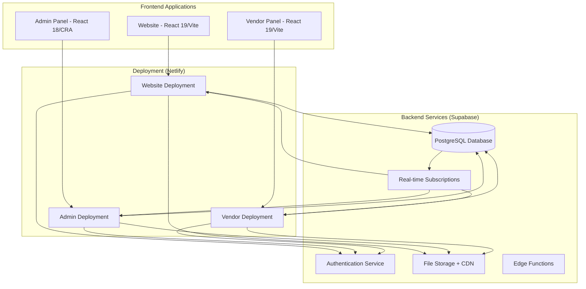
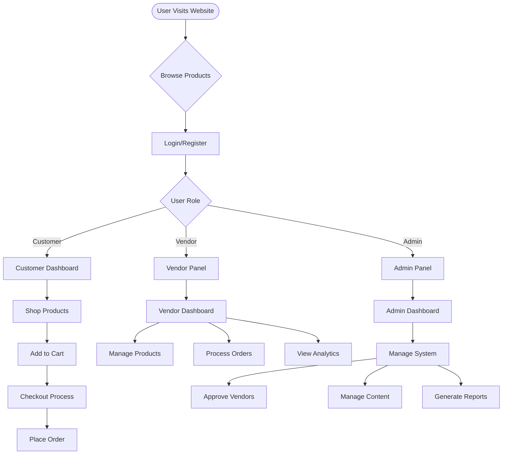
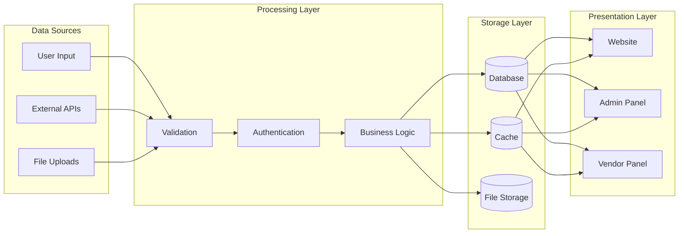

# Clinic Kart - Multi-Panel Web Application Analysis & Deployment Plan

## Executive Summary

Clinic Kart is a comprehensive multi-panel web application designed for dental/medical e-commerce operations. The system consists of three interconnected React-based applications:

1. **Website** - Public-facing e-commerce platform (React 19 + Vite)
2. **Admin Panel** - Administrative dashboard (React 18 + CRA)
3. **Vendor Panel** - Vendor management interface (React 19 + Vite)

**Current Status**: Template/prototype stage with placeholder API services and mock authentication
**Architecture**: Frontend-only applications requiring backend integration
**Deployment**: Configured for Vercel deployment with SPA routing

## Technology Stack Analysis

### Website (Public E-commerce Platform)
- **Framework**: React 19.1.0 with Vite 6.3.5
- **Styling**: TailwindCSS 4.1.11 with custom design system
- **State Management**: React Context API
- **Routing**: React Router DOM 7.6.1
- **Charts**: ApexCharts 4.7.0 + React ApexCharts
- **Forms**: React Hook Form 7.57.0
- **UI Components**: Lucide React icons, React Slick carousel
- **Build Tools**: Vite with SWC, image optimization, SSG support

### Admin Panel (Administrative Dashboard)
- **Framework**: React 18.2.0 with Create React App
- **Styling**: TailwindCSS 3.1.4 + Bootstrap 5.2.2 + Ant Design 5.12.1
- **State Management**: Redux Toolkit 2.0.1
- **UI Library**: Syncfusion components, Material Design Bootstrap
- **Charts**: ApexCharts 3.52.0 + Recharts 2.1.12
- **Rich Text**: React Quill, Draft.js, Jodit React
- **Calendar**: React Big Calendar, React DatePicker
- **Backend Integration**: Firebase 10.6.0, Axios 0.27.2

### Vendor Panel (Vendor Management)
- **Framework**: React 19.1.0 with Vite 6.3.5
- **Styling**: TailwindCSS 4.1.11 (identical to Website)
- **Architecture**: Mirrors Website structure and dependencies
- **Features**: Dashboard, product management, invoicing, transactions

## Application Architecture Analysis

### Website Structure
```
src/
├── components/
│   ├── charts/          # Data visualization components
│   ├── common/          # Reusable UI components
│   └── layout/          # Header, Footer, Navigation
├── context/             # React Context for state management
├── hooks/               # Custom React hooks
├── pages/               # Route-based page components
├── routes/              # Routing configuration
├── services/            # API service layer (placeholder)
└── utils/               # Helper functions and constants
```

### Admin Panel Structure
```
src/
├── Component/           # Reusable components
├── Layout/              # HOC, Navbar, Sidebar
├── Pages/               # Feature-based page organization
├── Repository/          # API service layer with Axios
├── Routes/              # Route definitions
└── utils/               # Utility functions
```

### Key Features by Panel

#### Website Features
- E-commerce product catalog
- Shopping cart functionality
- User authentication system
- Blog/content management
- Vendor and brand pages
- Customer profile management
- Order tracking
- Multi-step checkout process

#### Admin Panel Features
- Comprehensive dashboard with analytics
- Product management (CRUD operations)
- Vendor management and approval
- Customer management
- Order processing
- Content management (blogs, banners)
- Payment and subscription management
- Location and category management
- Notification system

#### Vendor Panel Features
- Vendor dashboard with metrics
- Product catalog management
- Customer relationship management
- Transaction history
- Invoice generation and management
- Return/refund processing
- Profile and settings management

## Integration Analysis

### Current Integration Points
1. **Shared Design System**: Common TailwindCSS configuration
2. **Similar Architecture**: Website and Vendor Panel share identical structure
3. **Authentication Flow**: All panels expect token-based authentication
4. **API Integration**: Admin Panel has functional API layer, others have placeholders

### Missing Integration Components
1. **Unified Backend API**: No shared backend service
2. **Cross-Panel Communication**: No data synchronization
3. **Shared Authentication**: Independent auth systems
4. **Real-time Updates**: No WebSocket or real-time features
5. **File Upload/Storage**: No media management system

## Backend Requirements Analysis

### Current Backend Dependencies
- **Admin Panel**: Uses `process.env.React_App_Baseurl` for API calls
- **Authentication**: JWT token-based with localStorage
- **File Handling**: React PDF renderer, HTML2PDF
- **Email**: EmailJS integration
- **Firebase**: Configured but not actively used

### Required Backend Services
1. **Authentication & Authorization**
   - User registration/login
   - Role-based access control (Admin, Vendor, Customer)
   - JWT token management
   - Password reset functionality

2. **Database Schema**
   - Users (customers, vendors, admins)
   - Products (catalog, inventory, pricing)
   - Orders (transactions, status tracking)
   - Categories and brands
   - Content management (blogs, banners)
   - Notifications and communications

3. **API Endpoints**
   - RESTful API for all CRUD operations
   - File upload/download endpoints
   - Payment processing integration
   - Email notification system
   - Analytics and reporting

4. **Real-time Features**
   - Order status updates
   - Inventory synchronization
   - Notification system
   - Chat/messaging (future enhancement)

## Deployment Strategy Recommendations

### Option 1: Supabase + Netlify (Recommended)
**Advantages:**
- **Supabase Benefits:**
  - PostgreSQL database with real-time subscriptions
  - Built-in authentication with role-based access
  - File storage with CDN
  - Edge functions for custom logic
  - Real-time database changes
  - Built-in API generation

- **Netlify Benefits:**
  - Excellent React/Vite support
  - Automatic deployments from Git
  - Edge functions for serverless logic
  - Form handling and identity management
  - CDN and performance optimization

**Implementation Plan:**
1. Set up Supabase project with database schema
2. Configure Row Level Security (RLS) policies
3. Implement authentication flows
4. Deploy each panel to separate Netlify sites
5. Configure environment variables and API endpoints

### Option 2: Hostinger + Custom Backend
**Advantages:**
- Full control over backend implementation
- Can use existing Hostinger infrastructure
- Custom API design flexibility

**Disadvantages:**
- Requires backend development from scratch
- More complex deployment and maintenance
- Higher development time and cost

### Option 3: Vercel + Supabase
**Advantages:**
- Excellent React/Next.js support
- Serverless functions
- Edge computing capabilities
- Git-based deployments

**Current Configuration:**
- Both Website and Vendor Panel have `vercel.json` configured
- SPA routing setup with catch-all rewrites

## Database Schema Recommendations

### Core Tables (Supabase)
```sql
-- Users table with role-based access
users (
  id UUID PRIMARY KEY,
  email TEXT UNIQUE,
  role TEXT CHECK (role IN ('customer', 'vendor', 'admin')),
  profile JSONB,
  created_at TIMESTAMP
)

-- Products table
products (
  id UUID PRIMARY KEY,
  vendor_id UUID REFERENCES users(id),
  name TEXT,
  description TEXT,
  price DECIMAL,
  category_id UUID,
  inventory INTEGER,
  status TEXT,
  images TEXT[]
)

-- Orders table
orders (
  id UUID PRIMARY KEY,
  customer_id UUID REFERENCES users(id),
  vendor_id UUID REFERENCES users(id),
  items JSONB,
  total DECIMAL,
  status TEXT,
  created_at TIMESTAMP
)
```

## Security Considerations

### Authentication & Authorization
1. **Row Level Security (RLS)**: Implement Supabase RLS policies
2. **JWT Validation**: Secure token handling across all panels
3. **Role-based Access**: Restrict features based on user roles
4. **API Security**: Rate limiting and input validation

### Data Protection
1. **Environment Variables**: Secure API keys and secrets
2. **HTTPS Enforcement**: SSL certificates for all domains
3. **Input Sanitization**: Prevent XSS and SQL injection
4. **File Upload Security**: Validate and scan uploaded files

## Performance Optimization

### Frontend Optimizations
1. **Code Splitting**: Lazy loading implemented in routing
2. **Image Optimization**: Vite image optimizer configured
3. **Bundle Analysis**: Monitor and optimize bundle sizes
4. **Caching Strategy**: Implement service workers

### Backend Optimizations
1. **Database Indexing**: Optimize query performance
2. **CDN Integration**: Supabase storage with CDN
3. **Caching Layer**: Redis for session and data caching
4. **API Rate Limiting**: Prevent abuse and ensure stability

## Migration and Development Plan

### Phase 1: Backend Setup (Week 1-2)
1. Set up Supabase project and database schema
2. Configure authentication and RLS policies
3. Create API endpoints and test with Postman
4. Set up file storage and CDN

### Phase 2: API Integration (Week 3-4)
1. Replace placeholder API services in all panels
2. Implement authentication flows
3. Connect forms and data management
4. Test cross-panel data synchronization

### Phase 3: Deployment and Testing (Week 5-6)
1. Deploy all panels to production environment
2. Configure CI/CD pipelines
3. Implement monitoring and logging
4. Conduct comprehensive testing

### Phase 4: Production Optimization (Week 7-8)
1. Performance optimization and monitoring
2. Security audit and penetration testing
3. User acceptance testing
4. Documentation and training

## Cost Analysis

### Supabase + Netlify Costs
- **Supabase Pro**: $25/month (includes 8GB database, 100GB bandwidth)
- **Netlify Pro**: $19/month per site × 3 = $57/month
- **Total Monthly**: ~$82/month for production-ready setup

### Scalability Considerations
- Supabase scales automatically with usage
- Netlify provides global CDN and edge functions
- Can upgrade tiers as traffic grows
- Real-time features included in base pricing

## System Architecture Diagrams

### Overall System Architecture


### User Flow Diagram


### Data Flow Architecture


## Detailed Implementation Steps

### Step 1: Supabase Backend Setup
```bash
# 1. Create Supabase project
npx supabase init
npx supabase start

# 2. Set up database schema
npx supabase db reset

# 3. Configure authentication
# Enable email/password and social providers in Supabase dashboard

# 4. Set up Row Level Security policies
# Apply RLS policies for multi-tenant architecture
```

### Step 2: Environment Configuration
```javascript
// .env files for each panel
// Website/.env
VITE_SUPABASE_URL=your_supabase_url
VITE_SUPABASE_ANON_KEY=your_anon_key
VITE_APP_ENV=production

// Admin_Panel/.env
REACT_APP_SUPABASE_URL=your_supabase_url
REACT_APP_SUPABASE_ANON_KEY=your_anon_key
REACT_APP_BASEURL=your_api_url

// Vendor_Panel/.env
VITE_SUPABASE_URL=your_supabase_url
VITE_SUPABASE_ANON_KEY=your_anon_key
VITE_APP_ENV=production
```

### Step 3: API Service Implementation
```javascript
// services/supabase.js
import { createClient } from '@supabase/supabase-js'

const supabaseUrl = process.env.VITE_SUPABASE_URL
const supabaseKey = process.env.VITE_SUPABASE_ANON_KEY

export const supabase = createClient(supabaseUrl, supabaseKey)

// Authentication service
export const authService = {
  signUp: (email, password, userData) =>
    supabase.auth.signUp({ email, password, options: { data: userData } }),

  signIn: (email, password) =>
    supabase.auth.signInWithPassword({ email, password }),

  signOut: () => supabase.auth.signOut(),

  getUser: () => supabase.auth.getUser()
}
```

### Step 4: Database Schema Implementation
```sql
-- Enable RLS
ALTER TABLE users ENABLE ROW LEVEL SECURITY;
ALTER TABLE products ENABLE ROW LEVEL SECURITY;
ALTER TABLE orders ENABLE ROW LEVEL SECURITY;

-- RLS Policies
CREATE POLICY "Users can view own profile" ON users
  FOR SELECT USING (auth.uid() = id);

CREATE POLICY "Vendors can manage own products" ON products
  FOR ALL USING (auth.uid() = vendor_id);

CREATE POLICY "Customers can view published products" ON products
  FOR SELECT USING (status = 'published');
```

### Step 5: Deployment Configuration
```yaml
# netlify.toml for each panel
[build]
  command = "npm run build"
  publish = "dist"

[build.environment]
  NODE_VERSION = "18"

[[redirects]]
  from = "/*"
  to = "/index.html"
  status = 200

[[headers]]
  for = "/*"
  [headers.values]
    X-Frame-Options = "DENY"
    X-XSS-Protection = "1; mode=block"
```

## Testing Strategy

### Unit Testing
- **Frontend**: Jest + React Testing Library
- **API**: Supabase client testing
- **Components**: Isolated component testing

### Integration Testing
- **API Integration**: Test all CRUD operations
- **Authentication Flow**: Multi-panel auth testing
- **Cross-panel Data**: Synchronization testing

### End-to-End Testing
- **User Journeys**: Complete workflow testing
- **Performance**: Load testing with realistic data
- **Security**: Penetration testing and vulnerability assessment

## Monitoring and Analytics

### Application Monitoring
- **Netlify Analytics**: Built-in performance monitoring
- **Supabase Dashboard**: Database and API monitoring
- **Error Tracking**: Sentry integration for error monitoring

### Business Analytics
- **User Behavior**: Google Analytics 4
- **E-commerce Tracking**: Enhanced e-commerce events
- **Custom Metrics**: Supabase functions for business intelligence

## Maintenance and Support

### Regular Maintenance Tasks
1. **Security Updates**: Monthly dependency updates
2. **Performance Monitoring**: Weekly performance reviews
3. **Database Optimization**: Quarterly database maintenance
4. **Backup Verification**: Daily backup testing

### Support Infrastructure
1. **Documentation**: Comprehensive API and user documentation
2. **Issue Tracking**: GitHub Issues or Jira integration
3. **User Support**: Help desk integration
4. **Knowledge Base**: FAQ and troubleshooting guides

## Conclusion

The Clinic Kart multi-panel application is a well-structured template with modern React architecture. The recommended approach is to integrate with Supabase for backend services and deploy on Netlify for optimal performance and developer experience. This combination provides:

1. **Rapid Development**: Pre-built authentication and database
2. **Scalability**: Cloud-native architecture
3. **Security**: Built-in security features and best practices
4. **Cost-Effectiveness**: Competitive pricing with room to scale
5. **Developer Experience**: Excellent tooling and documentation

The estimated timeline for full production deployment is 6-8 weeks with a dedicated development team.

## Next Immediate Actions

1. **Set up Supabase project** and configure database schema
2. **Create development environment** with proper environment variables
3. **Implement authentication service** across all three panels
4. **Set up CI/CD pipeline** for automated deployments
5. **Begin API integration** starting with the Admin Panel (most complete)

This comprehensive analysis provides a roadmap for transforming the template into a fully functional, production-ready multi-panel e-commerce platform.
